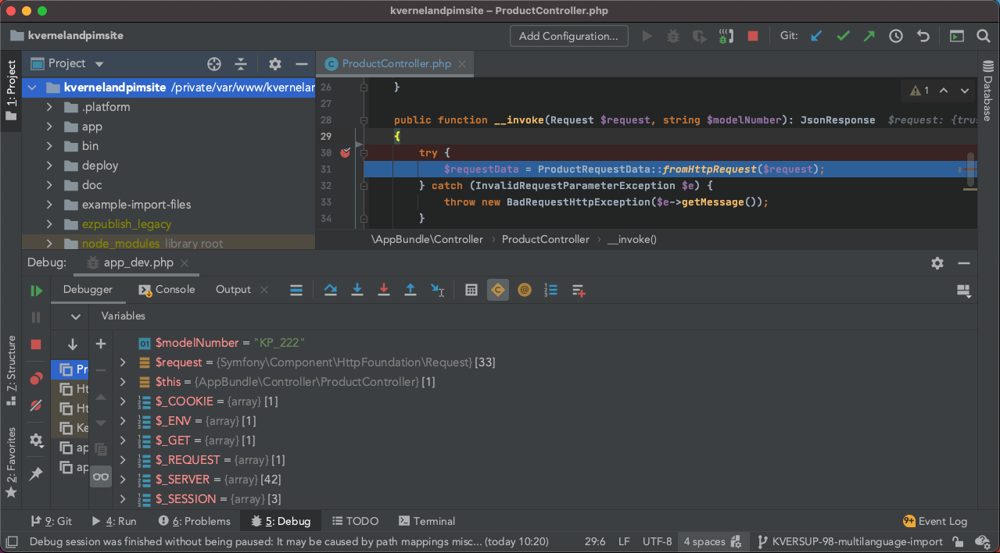

Set up XDebug
=============

XDebug is an extension for PHP that will help us with code debugging.
We’ll use it combined with PHP Storm, which will provide us the step
debugging feature, i.e. enable us to break during the code execution,
inspect the variables in scope and evaluate code in the Console.

Install
-------
   sudo apt install php5.6-xdebug
   sudo apt install php7.1-xdebug
   sudo apt install php7.2-xdebug
   sudo apt install php7.3-xdebug
   sudo apt install php7.4-xdebug
   sudo apt install php8.0-xdebug
   sudo apt install php8.1-xdebug
   sudo apt install php8.2-xdebug

Configure PHP
-------------

The congifuration to enable the debugger may not work on Ubuntu when
added to ``php.ini``. If debugging doesn’t work and the XDebug section
of ``phpinfo`` says that the Step Debugger is disabled, try adding the
configuration to the XDebug-specific configuration file. The file will
have a name similar to ``20-xdebug.ini``. This file should appear in the
printout of the command

::

   php --ini

If there is no such configuration file, make sure that XDebug is enabled
by running

::

   sudo phpenmod -v ALL -s ALL xdebug

Configure XDebug on PhpStorm
----------------------------

1. Open ``Preferences/Languages and Frameworks/PHP``.

2. Add your CLI interpreter here by opening CLI Interpreters window:
   inside it, click on plus sign and select *Other Local…*

3. Now you’ll need to adjust the PHP executable file path. If you’re
   unsure where your current PHP version executable file is, simply
   execute: ``which php`` and it will give you the path to the needed
   file.

   If everything is done correctly, PhpStorm should now list your PHP
   version, XDebug as debugger and PHP configuration file, looking
   something like this:

   .. figure:: phpstorm-xdebug-config.png
      :alt: PhpStorm XDebug config

      PhpStorm XDebug config

4. *Skip this step if using XDebug version 2 or below (default port on
   these versions is 9000 so no adjustment is needed).*

   Next, we need to adjust debug port to 9003 which is the default
   XDebug port. Do so by going to
   ``Preferences/Languages and Frameworks/PHP/Debug`` and setting *Debug
   port* under XDebug to 9003.

5. In the end we just need to start listening to debug connections:
   enable ``Run/Start Listening for PHP Debug Connections`` in the menu
   bar or use the shortcut button with the phone icon on the top right
   side of PhpStorm window.

Activating debugger
-------------------

The easiest way for activating debugger is by installing XDebug Helper
browser extensions. Choose your favorite browser, install and configure
extension, and you’ll be able to start and stop debugging mode in your
browser with just a few clicks. - `XDebug Helper for
Firefox <https://addons.mozilla.org/en-GB/firefox/addon/xdebug-helper-for-firefox/>`__
- `XDebug Helper for
Chrome <https://chrome.google.com/webstore/detail/xdebug-helper/eadndfjplgieldjbigjakmdgkmoaaaoc>`__
- `XDebug Helper for
Safari <https://apps.apple.com/app/safari-xdebug-toggle/id1437227804?mt=12>`__

Alternatively, if you want to activate the debugger manually, you’ll
need to add a trigger to your requests. Depending on what you need, add
one of the following: - ``XDEBUG_SESSION=session_name`` as an additional
GET (or POST) parameter if you want to initiate debugging on that single
request - ``XDEBUG_SESSION=session_name`` as a cookie: debugging will
now be initiated as long as that cookie is present

(value of ``session_name`` here is not important, you can set it to
whatever you like)

Test
----

Finally, choose a request you want to debug, set a breakpoint in
PhpStorm on the line in your code you’re sure that your request will hit
and fire away. If everything went well, PhpStorm should have opened
debug window and now you have complete insight in what is happening in
your code.

   PhpStorm debug window

Easily enable and disable XDebug
--------------------------------

To prevent XDebug slowing down our requests when we are not debugging,
it would be wise to disable it whenever we’re not using it. That’s why
we’ll guide you to write a few shell scripts and aliases with which
XDebug enabling or disabling will be a matter of entering a three-letter
command in terminal.

What we’ll want to do is rename ``xdebug.ini`` file so that it can’t be
found and hence won’t be loaded, and after that reload PHP-FPM server.
Again, as an example, everything will be done for PHP 7.4 so don’t
forget to adjust commands to your version.

Ubuntu configuration
~~~~~~~~~~~~~~~~~~~~

To enable XDebug on all PHP versions and SAPIs:

::

   sudo phpenmod -v ALL -s ALL xdebug

To disable XDebug on all PHP versions and SAPIs:

::

   sudo phpdismod -v ALL -s ALL xdebug

And reload fpm after that:

::

   sudo systemctl reload php7.4-fpm
