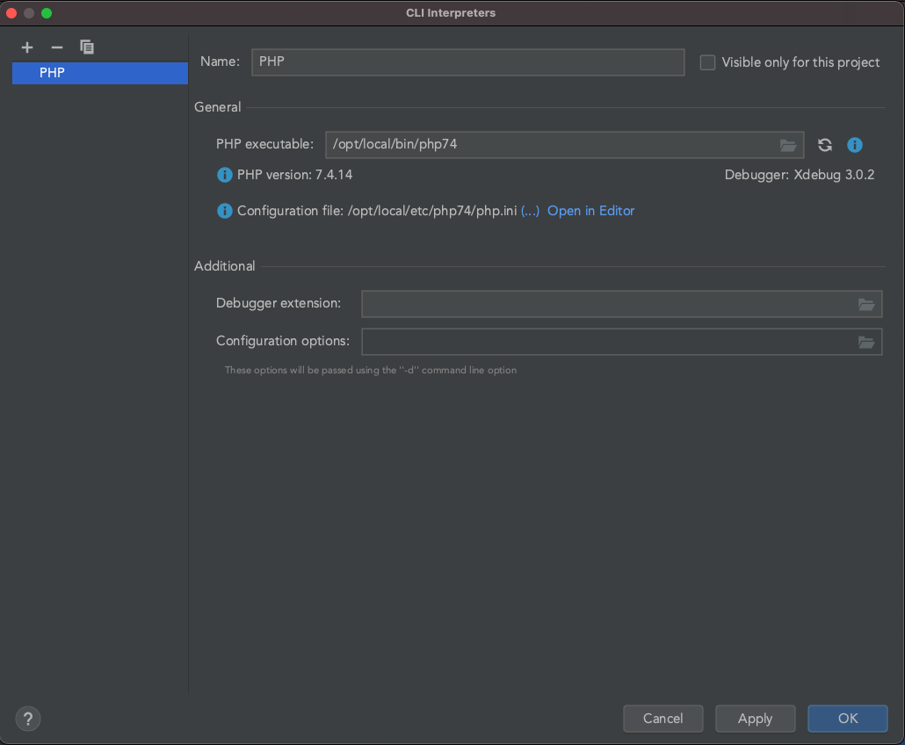
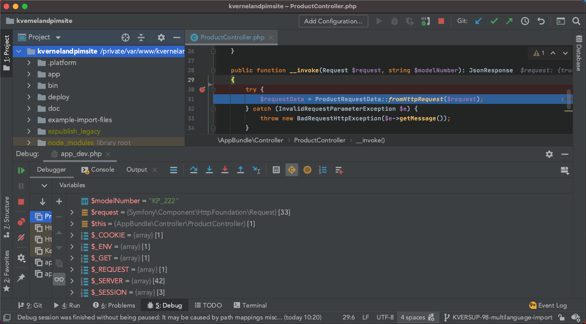

# Set up XDebug

## Install

### MacPorts install
MacPorts provide multiple ports for installing XDebug, based on the PHP version you're using. So, to check your version, execute on the command line:
```
php -v
```
and select the appropriate port from the list found [here](https://ports.macports.org/?search=xdebug&search_by=name).

For example, if your PHP version is 7.4, you'll need to execute
```
sudo port install php74-xdebug
```

Now, when executing
```
php -v
```
among other data, you should see XDebug in the output. Just by this setup you already have some XDebug benefits, such as that `var_dump()` function will now be upgraded to have a nicer output. But to fully benefit XDebug, it is wise to add few more adjustments to configure step debugging and connect it to PhpStorm.

## Configure PHP
Configure XDebug's step debugging by adding the following line to `php.ini`:
```
xdebug.mode=debug,develop
```
If you're not sure which `php.ini` file to edit, you can check that by executing
```
php --ini
```
Make sure you restart your web server and PHP-FPM server after making these changes. If you followed this development setup, then reload commands should look something like this:
```
sudo port reload nginx
sudo port reload php74-fpm
```

## Configure XDebug on PhpStorm

1. Open `System Preferences/Languages and Frameworks/PHP`.
1. Add your CLI interpreter here by opening CLI Interpreters window: inside it, click on plus sign and select *Other Local...*
1. Now you'll need to adjust the PHP executable file path. If you're unsure where your current PHP version executable file is, simply execute:
    ```
    which php
    ```
    and it will give you the path to the needed file.

    If everything is done correctly, PhpStorm should now list your PHP version, XDebug as debugger and PHP configuration file, looking something like this:
    
    

1. Next, we need to adjust debug port to 9003 which is the default XDebug port. Do so by going to `System Preferences/Languages and Frameworks/PHP/Debug` and setting *Debug port* under XDebug to 9003.
1. In the end we just need to start listening to debug connections: enable `Run/Start Listening for PHP Debug Connections` in the menu bar or use the shortcut button with the phone icon on the top right side of PhpStorm window.

## Activating debugger
The easiest way for activating debugger is by installing XDebug Helper browser extensions. Choose your favorite browser, install and configure extension, and you'll be able to start and stop debugging mode in your browser with just a few clicks.
- [XDebug Helper for Firefox](https://addons.mozilla.org/en-GB/firefox/addon/xdebug-helper-for-firefox/)
- [XDebug Helper for Chrome](https://chrome.google.com/webstore/detail/xdebug-helper/eadndfjplgieldjbigjakmdgkmoaaaoc)
- [XDebug Helper for Safari](https://apps.apple.com/app/safari-xdebug-toggle/id1437227804?mt=12)

Alternatively, if you want to activate the debugger manually, you'll need to add a trigger to your requests. Depending on what you need, add one of the following:
- `XDEBUG_SESSION=session_name` as an additional GET (or POST) parameter if you want to initiate debugging on that single request
- `XDEBUG_SESSION=session_name` as a cookie: debugging will now be initiated as long as that cookie is present

(value of `session_name` here is not important, you can set it to whatever you like)

## Test
Finally, choose a request you want to debug, set a breakpoint in PhpStorm on the line in your code you're sure that your request will hit and fire away. If everything went well, PhpStorm should have opened debug window and now you have complete insight in what is happening in your code.


